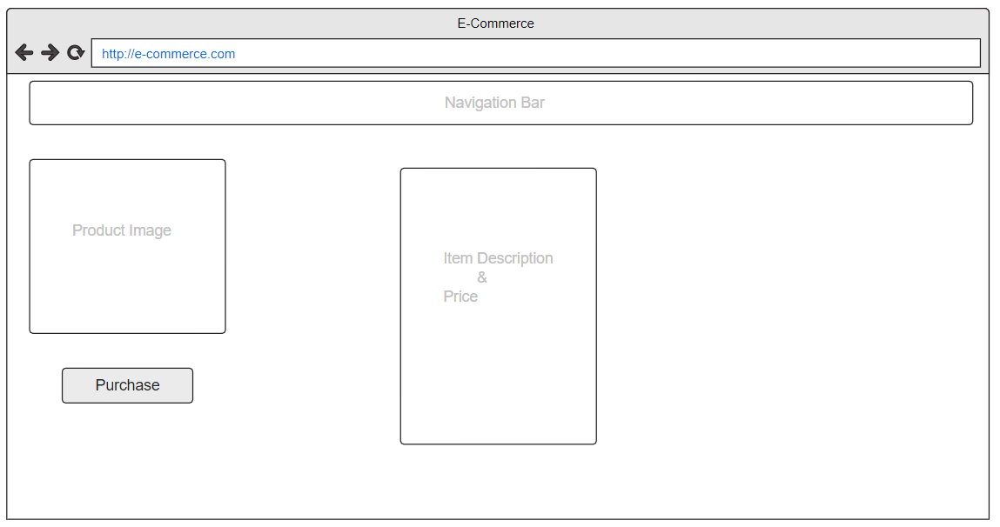

# Passion Project for FullStack e-Commerce Website
### This will going to be a fullstack fully responsive e-commerce website in which Add to cart functionality and Payment Gateways will be added to learn more about the fullstack and payment gateways. Also the site will be deploy using firebase and also firebase will be the database used to store the user information and history of the orders. 

## Platform Choice: Front-end(React), Database(Firebase) and Backend(Node.js)

## Dependencies for installation: 
* yarn add firebase
* npm install -g firebase-tools
* npm install @material-ui/core
* npm install @material-ui/icons
* npm install @material-ui/lab
* npm install react-router-dom
* npm install react-currency-format
* npm install @stripe/stripe-js
* npm install @stripe/react-stripe-js
* npm install axios
* npm install express { it should be under the function folder in app as it wil be the cloud backend functionality using express}
* npm install cors { same under the functions folder }
* npm install stripe { same under the function folder }
* npm install moment { for the order dates functionality }

## Prototype Images:
* Home Page: 

* Cart Page:

* Sign Up:

